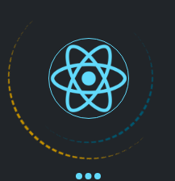
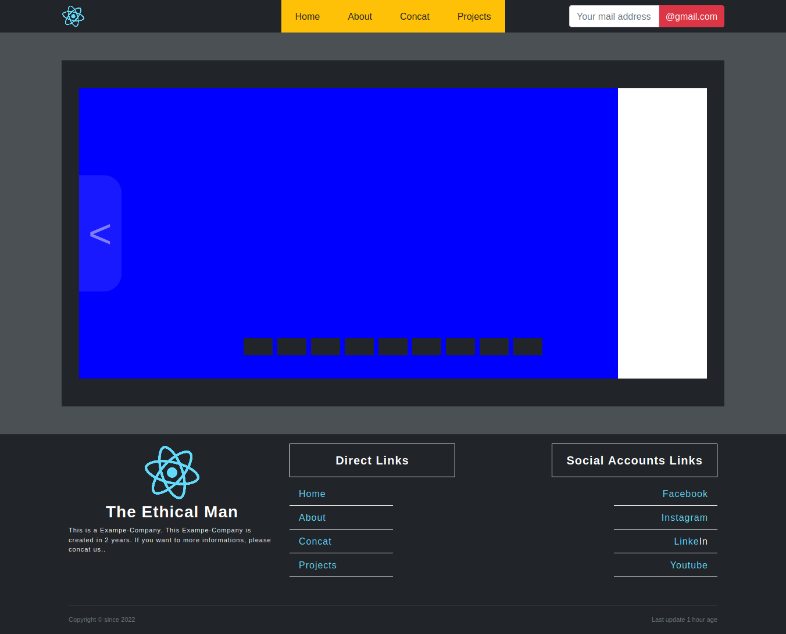
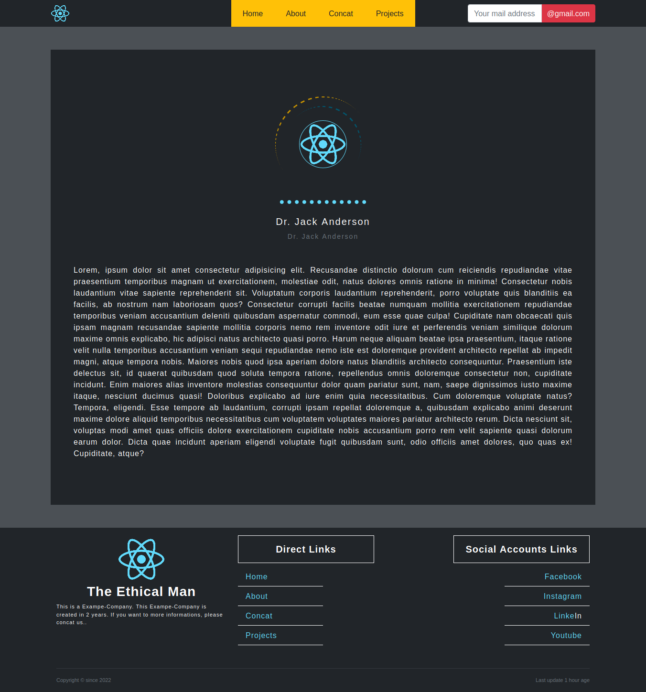
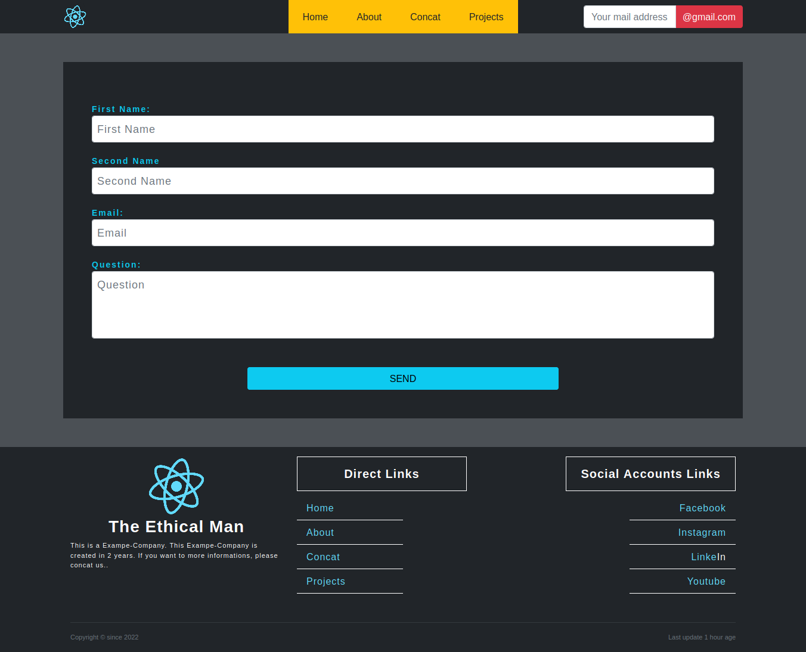
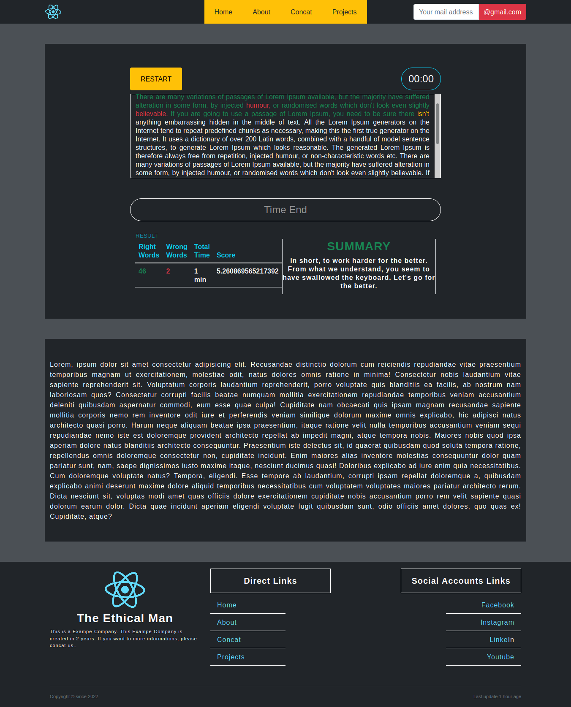

<h1 align="center" >
	  <br>
	  <a href="https://www.ademcck.com/"></a>
</h1>

###### NPM START

```bash
┌──(ademcck㉿kali)-[~/…/all/projects/react/0x1-reactapp]
└─$ npm start

Compiled successfully!

You can now view reactapp in the browser.

  Local:            http://localhost:3000
  On Your Network:  http://127.0.0.1:3000

Note that the development build is not optimized.
To create a production build, use npm run build.

assets by path static/js/*.js 2.96 MiB
  asset static/js/bundle.js 2.96 MiB [emitted] (name: main) 1 related asset
  asset static/js/node_modules_web-vitals_dist_web-vitals_js.chunk.js 6.88 KiB [emitted] 1 related asset
asset index.html 1.67 KiB [emitted]
asset asset-manifest.json 458 bytes [emitted]
cached modules 2.67 MiB [cached] 244 modules
runtime modules 31.4 KiB 15 modules
./node_modules/webpack-dev-server/client/index.js?protocol=ws%3A&hostname=0.0.0.0&port=3000&pathname=%2Fws&logging=none&reconnect=10 6.59 KiB [built] [code generated]
webpack 5.65.0 compiled successfully in 8654 ms
```


###### JSON-SERVER START


```bash
┌──(ademcck㉿kali)-[~/…/all/projects/react/0x1-reactapp]
└─$ json-server --watch api/db.json

  \{^_^}/ hi!

  Loading api/db.json
  Done

  Resources
  http://localhost:3000/products
  http://localhost:3000/categories
  http://localhost:3000/text
  http://localhost:3000/scoreSummary

  Home
  http://localhost:3000

  Type s + enter at any time to create a snapshot of the database
  Watching...
```
### screenshout [HOME]
<h1 align="center" >
  
</h1>

### screenshout [ABOUT]

<h1 align="center" >
  
</h1>

### screenshout [CONCAT]

<h1 align="center" >
  
</h1>

### screenshout [PROJECTS]

<h1 align="center" >
  
</h1>
